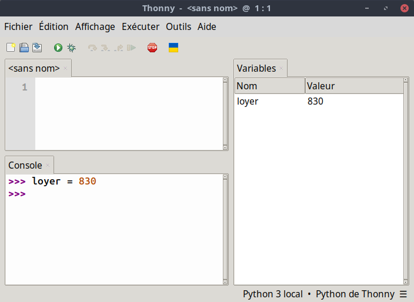
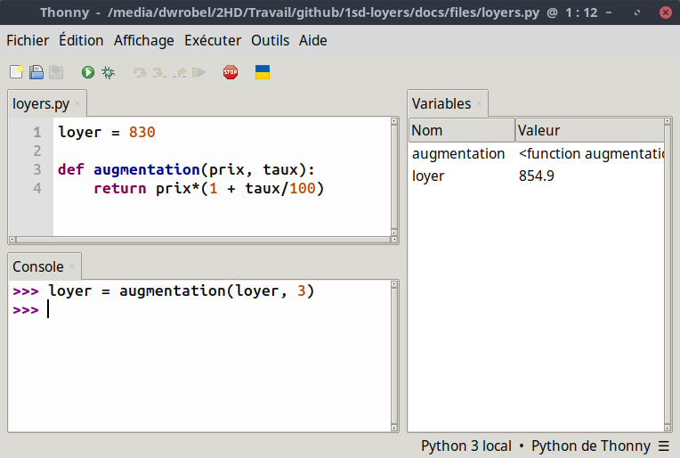

# Étude d'un loyer

## Pour commencer

Lorsqu'un un individu souhaite habiter dans un logement, il se présente à lui deux solutions :

- acheter ce logement ;
- louer ce logement.

<center>
    
</center>

La location consiste à utiliser le logement payé par une autre personne et en contrepartie, le locataire doit lui verser un loyer.

### Un exemple

Un particulier propose son appartement T3 situé à Tourcoing.

<center>
    
</center>

Le loyer est de **830 euros**.

!!!question "Pour commencer"

    1. Ouvrir Thonny et définir la variable `loyer` qui vaut 830.
    2. Dans le Menu **Affichage** du logiciel, vérifier que l'item **Variables** est bien coché.

        <center>
            
        </center>

    3. Le loyer subit une augmentation de **3%**. Taper l'instruction `loyer*(1+3/100)` dans la console.
        
        1. Quelle valeur obtient-on ?
        2. La valeur de la variable `loyer` a-t-elle été modifiée ?

    4. Pour mettre à jour la valeur du loyer, taper la commande `loyer = loyer*(1+3/100)` et observer le contenu de la variable `loyer`.
    5. Le propriétaire décide d'augmenter le loyer de 3% **tous les ans**.  
    
        1. Taper les instructions pour obtenir le prix du loyer après cinq années.
        2. Au bout de combien d'années le loyer dépassera-t-il **1000 euros** ?

### Avec des fonctions

Pour commencer, vous êtes invité à télécharger le fichier  [loyers.py](<./files/loyers.py>).

!!! question "Quelques manipulations"

    1. Ouvrir le fichier avec Thonny et l'exécuter avec l'icône .
    2. Taper l'instruction `loyer = augmentation(loyer, 3)` et observer l'effet sur la variable `loyer`.

        <center>
            
        </center>

    3. Pour éviter d'avoir à taper **cinq fois** l'instruction `loyer = augmentation(loyer, 3)` on peut aussi écrire dans la console :

        ``` python title="Première notion de boucle" linenums="1"

        for i in range(5):
            loyer = augmentation(loyer, 3)
        ```

        qui signifie : **Répète 5 fois l'instruction `loyer = augmentation(loyer, 3)`**.

    4. Dans le script, écrire une fonction `reduction(prix, taux)` qui renvoie le nouveau prix après **une réduction de taux %**.

        1. Relancer le script avec l'icône .
        2. Observer que la variable `loyer` est revenue à son prix initial.
        3. Réaliser 10 augmentations de 5% sur le loyer à l'aide d'une boucle.
        4. Effectuer une réduction de 50% sur le loyer à l'aide d'une instruction et observer qu'on ne revient pas au prix initial.